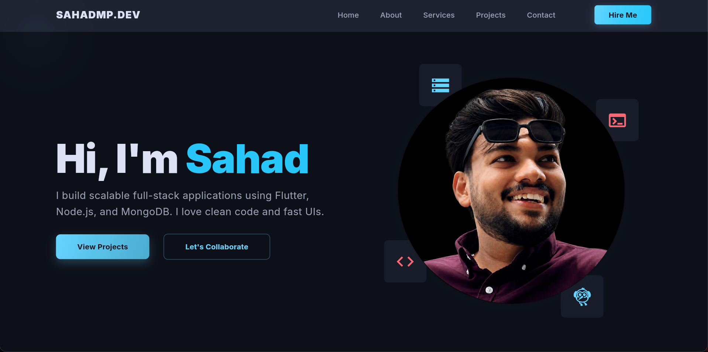

# Sahad MP - Senior Developer Portfolio

Welcome to my portfolio! I am a passionate Senior Developer with a proven track record of designing, building, and delivering high-quality, scalable applications. This repository showcases my latest projects, technical skills, and contributions.

## 🚀 About Me

- 💻 Senior Developer specializing in Mobile (Flutter/Dart) and robust backend solutions.
- 🏗️ Architecting scalable, maintainable, and high-performance applications.
- 🤝 Passionate about mentoring, clean code, and agile methodologies.
- 🌟 Constantly exploring new technologies to solve complex problems effectively.

## 🛠️ Tech Stack

- **Mobile:** Flutter, Dart
- **Backend:** Node.js, Python, Firebase, SQL/NoSQL
- **DevOps/Tools:** Git, CI/CD, Docker

## 📸 Portfolio Preview

Here is a glimpse of my recent work:

## 📬 Let's Connect!

Feel free to reach out if you want to collaborate, discuss tech, or just say hi!
